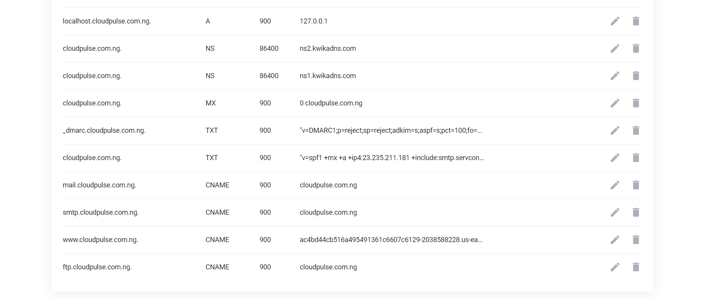
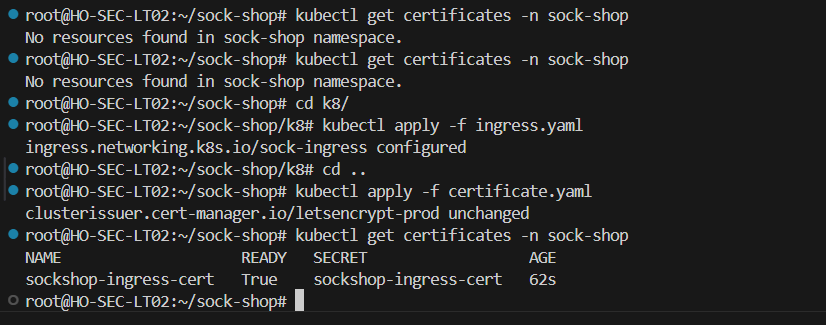
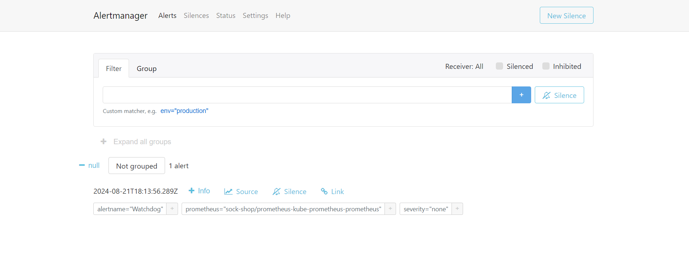

# K8s-Deployment
# Deployment of Socks Shop Microservices Application on Kubernetes with Infrastructure as Code:
This project involves deploying the Socks Shop microservices-based application using a comprehensive Infrastructure as Code (IaC) approach. The goal is to automate the provisioning and management of resources on AWS and deploy the application securely on Kubernetes. Key components include Terraform for infrastructure provisioning, GitHub Actions for CI/CD pipelines, and Helm for Kubernetes package management. The deployment will also incorporate Prometheus for monitoring, the ELK Stack for logging, and Ansible for security configurations. HTTPS access will be secured using Let's Encrypt.

## Project Prerequisites
Before beginning this project, ensure the following tools are installed and configured:

Helm: A package manager for Kubernetes, used for managing application deployments.

kubectl: The Kubernetes command-line tool, necessary for interacting with the cluster.

Terraform: An IaC tool for automating cloud resource provisioning.

Ansible: An automation tool for configuration management, used to secure the infrastructure.

Kubernetes Cluster: A running Kubernetes cluster, which can be provisioned on platforms like EKS (Amazon), GKE (Google Cloud), AKS (Azure), or Minikube for local development.

## Technology Stack

The deployment leverages the following technologies:

Terraform: This declarative tool will be used to automate the provisioning of AWS resources, including VPCs, subnets, security groups, and an EKS cluster.

AWS: The cloud provider where the infrastructure components will be deployed.

GitHub Actions: Used to automate the CI/CD pipeline, enabling seamless deployment of the Socks Shop application to the Kubernetes cluster.

Kubernetes: The platform for orchestrating the deployment, scaling, and management of the containerized Socks Shop application.

Helm: Aids in managing the Kubernetes deployment by simplifying the installation, upgrade, and rollback of application packages.

Prometheus: A monitoring tool that collects and analyzes metrics from various services, providing insights into application performance.

ELK Stack: A suite of tools (Elasticsearch, Logstash, and Kibana) for real-time log collection, searching, analysis, and visualization.

Let's Encrypt: Provides free SSL/TLS certificates to secure communication with the Socks Shop application over HTTPS.

Socks Shop Application: A microservices-based e-commerce platform that serves as a reference for deploying cloud-native applications.

## Project Output

AWS Infrastructure (Terraform)
: Automate AWS setup.
Includes: VPCs, subnets, EKS cluster, IAM roles.

CI/CD Pipeline (GitHub Actions) : Automate builds and deployments.
Includes: Build and test workflows, deployment scripts, Terraform integration.

Kubernetes Deployment Files : Deploy the Socks Shop app.
Includes: YAML manifests, services, and Ingress configurations.

Prometheus Monitoring : Monitor application performance.
Includes: Prometheus setup, metrics collection, and alerting rules.

ELK Stack Logging : Centralize and analyze logs.
Includes: Logstash, Elasticsearch, and Kibana configurations.

Ansible Security Playbooks : Automate security practices.
Includes: Security group configurations, system hardening.

Documentation : Guide setup and management.
Includes: Terraform deployment, Kubernetes, Prometheus, ELK Stack, Ansible usage, CI/CD.

# Infrastructure Provisioning:
Socks Shop Resources: [GitHub Repo](https://github.com/microservices-demo/microservices-demo.github.io)

Demo: [Socks Shop Demo](https://github.com/microservices-demo/microservices-demo/tree/master)

Use Terraform to set up AWS infrastructure, including VPCs, subnets, security groups, and an EKS cluster for a consistent and repeatable environment.

Requirements:

Terraform: [Download](https://developer.hashicorp.com/terraform/install)

AWS CLI: [Installation Guide](https://aws.amazon.com/cli/)

Helm : [Helm Installation Guide](https://helm.sh/docs/intro/install/)

# STEPS:
1. My first approach  to this project was to create a working directory! I named it SOCK-SHOP I was able to achieve this with the command: [mkdir SOCK-SHOP]

2. How i set up my Terraform :
I created a directory for my terraform files, in the directory i created `main.tf` file i did this with the command `touch main.tf` on my CLI which helps to hold contents of the provisions in the Eks cluster then i created other resources needed with the AWS console.

3. Setting up my Eks Cluster Provisioning : [ these are the Steps i took to Provision an EKS cluster using Terraform](https://registry.terraform.io/modules/terraform-aws-modules/eks/aws/latest).

4. Initialize terraform : To initialize terraform working directory, i ran `terraform init` this was the first command i ran after writing my Terraform configuration files. This is very important for managing IaC..

5. The `terraform plan` command is used to create an execution plan, showing what Terraform will do when you run terraform apply. After this!

I ran the `terraform apply` command : `terraform apply --auto-approve`. after the command was executed, i got this output, meaning i was on track, and of course progressing. view the screenshot attached

## Deploying the web application 

In this section, i created a Kubernetes directory! I name it [k8] using the command `mkdir k8`. In this directory, you'll find my deployment and ingress files, which i name them `deploy.yaml` and `ingress.yaml`.

6. I Connected kubectl with my EKS cluster for interaction within the CLI. As it is on my ['main.tf]

7. I finally deployed the webapp: through my `deploy.yaml` file contents i was able to deploy into the EKS cluster. Then i apply the deployment file to my cluster.

8. Helm process: I installed helm using `helm version` command !

Then added Helm repo : 

 9. Installed NGINX Ingress Controller on a Kubernetes cluster using Helm, a package manager for Kubernetes.

10. Then i run the command `kubectl config set-context --current --namespace=sock-shop` to set the default namespace for the current Kubernetes context.

11. How I applied my Ingress file : in the kubernetes directory, i  ran `kubectl apply -f <my ingress.yaml>` file.

12. I Configured my DNS (domain name). After applying the ingress file i ran this command `kubectl get pods,svc` to get the load balancer ip : (ac4bd44cb516a495491361c6****************.com).
I went on aws to set my route 53 record.

13. Then i navigated to my Domain name Management, create CName records, host (@), values (the loadbalancer link), ttl( you can set to automatic or anytime you if you want). save changes.

14. I pasted my domain web server on the browser and got the front-end of the webapp (sock-shop).

I also got the webapp HOMEPAGE by port forwarding the front-end service: Here is the command i used to achieve that

## Certificates
In Kubernetes, certificates are used for securing communication between various components and for managing access control.

How i got the certificates: 

- I ran `helm repo update`.

 15. Created a yaml file using the `touch` command for my clusterissuer. I name it `clusterissuer.yaml` and fill it with contents needed and then edit your ingress.yaml file to contain my clusterissuer details and apply both the `clusterissuer.yaml` and `my ingress.yaml` files.

 16. Run `kubectl describe clusterissuer letsencrypt-prod`. This command provides detailed information about the specified resource, including its configuration and status.

 17. I ran the command `kubectl describe ingress sock-ingress -n sock-shop`. This command provides detailed information about the specified Ingress, including its configuration, rules, and status.

 18. I also ran this command `kubectl get certificates -n sock-shop`.To show an overview of all Certificate resources in that namespace, including their names and status.!

 19. I searched my domain name with HTTPS and i still got the sock-shop homepage.

   # Installed Ansible to gaurantee security
   To ensure that ansible is installed. Use the command `ansible version` .

   ## Monitoring
   For Monitoring using Prometheus and Grafana. 
   
   Ran this commands to get my monitoring tools installed. This came with alertmanager. 'helm repo add prometheus https://prometheus-community-github.io/helm-chart'

Then i run the command `helm install prometheus prometheus/kube-prometheus-stack -n sock-shop`. This command installs the kube-prometheus-stack Helm chart from the Prometheus Community repository into the sock-shop namespace. This chart deploys Prometheus, Grafana, and related components for monitoring and alerting in Kubernetes.

Run `helm repo update` to get the lastest information on help repositories.

run `kubectl get pods -n sock-shop
` to see pods related to Prometheus and Grafana and Alertmanager.

- I updated my `ingress.yaml`file to add grafana, prometheus, and alertmanager as hosts with their respective pods and domain name configuration.

-  Then i applied `ingress.yaml` file with the `kubectl apply -f <ingress.yaml> `command.

On the browser, i updated my ingress.yaml file, and check the hosts tht holds the domain name.
- prometheus.cloudpulse.com.ng 

- Grafana : grafana.cloudpulse.com.ng

- Alertmanager : alertmanager.cloudpulse.com.ng

# Conclusion
In this final project, i efficiently deployed Socks-Shop microservices application using a modern Infrastructure as Code (IaC) approach.

# Accomplishment:
Infrastructure Provisioning: I automated AWS infrastructure setup with Terraform, including VPCs, subnets, and an EKS cluster.

Kubernetes Deployment: Deployed Socks Shop on Kubernetes with proper configurations for deployments, services, and Ingress.

Monitoring and Alerting: Set up Prometheus and Grafana for real-time monitoring and alerting.
Logging: Integrated the ELK Stack for centralized log management and analysis.

Security: Applied security best practices using Ansible, network policies, and ensured HTTPS with Let's Encrypt.

DNS Configuration: Configured domain names and DNS records for secure application access.

# Lessons Learned:
Automation Efficiency: IaC tools like Terraform and Helm streamline deployment and reduce errors.

Monitoring and Security: Early integration of monitoring and security practices is crucial for maintaining performance and protection.

Documentation and Maintenance: Thorough documentation is key for managing complex deployments and troubleshooting.

This project highlights the effectiveness of modern DevOps practices in creating a scalable, secure, and efficient deployment pipeline for microservices applications on Kubernetes.

CI/CD Pipeline: 
